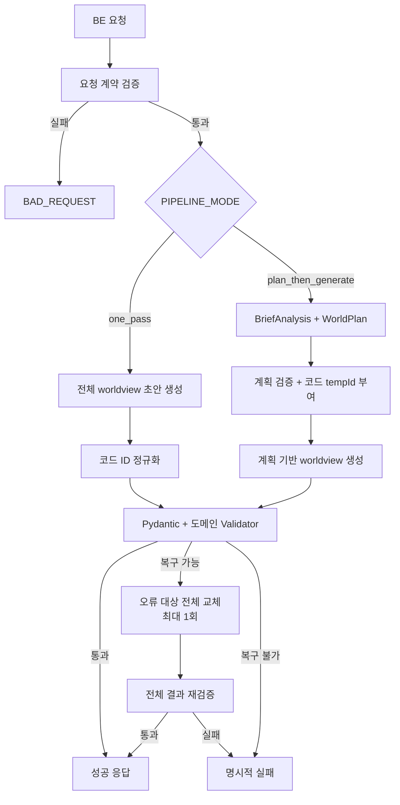

# MVP 워크플로우

상태: **Architecture Baseline**  
기준일: **2026-07-30**

이 문서는 SekAI AI 내부의 생성·검증 흐름을 정의합니다. 외부 요청·응답 필드는
[`AI-BE-CONTRACT.md`](https://github.com/Novel-SekAI/docs/blob/main/02-%EC%84%A4%EA%B3%84/AI-BE-CONTRACT.md)를,
엔티티 의미는
[`DATA-MODEL.md`](https://github.com/Novel-SekAI/docs/blob/main/02-%EC%84%A4%EA%B3%84/DATA-MODEL.md)를
우선합니다.

## 책임 경계

| 구간 | 책임 |
|---|---|
| FE | 입력 UX와 결과 표시 |
| BE | 인증, 외부 계약 검증, 재시작을 넘는 멱등성, UUID 치환, DB 트랜잭션 |
| AI | 생성, 구조화 출력, ID·참조 검증, 제한적 복구, `requestId` 추적 |
| vLLM | 모델 로딩, 배칭, 토큰 생성, JSON Schema 제약 |

AI 서버는 DB와 사용자 인증을 모르는 stateless 서비스입니다. BE에는 중간 산출물이나 진행 이벤트를 보내지 않고, 완전한 결과 또는 오류 하나만 반환합니다.

> 계약 정합 필요: 현재 공통 계약은 동일 `requestId`의 멱등 처리를 AI에 요구합니다. 재시작 이후까지 같은 결과를 보장하려면 상태 저장이 필요하므로, 영속 멱등성은 BE가 소유하고 AI는 `requestId` echo와 프로세스 범위의 중복 실행 방지만 담당하도록 공통 계약을 함께 수정해야 합니다.

## 최종 흐름



## 생성 모드

```text
PIPELINE_MODE=one_pass
PIPELINE_MODE=plan_then_generate
```

### `one_pass`

- 전체 `worldview`를 한 번에 생성하는 기준선
- 코드가 인물·세력의 로컬 키를 canonical `tempId`로 정규화
- 호출 수와 지연시간이 작음

### `plan_then_generate`

1. LLM이 `BriefAnalysis`와 `WorldPlan`을 생성합니다.
2. 코드가 계획을 검증합니다.
3. 코드가 인물·세력 슬롯에 `c1`, `c2`, `f1`, `f2` 형태의 `tempId`를 부여합니다.
4. LLM은 제공된 계획과 ID만 사용해 전체 `worldview`를 채웁니다.

두 단계 방식이 자동으로 기본값은 아닙니다. 동일 평가셋에서 품질 개선과 지연시간 비용을 비교해 기본 모드를 정합니다.

## 스키마 원칙

```text
공통 계약
→ Pydantic v2 모델
→ model_json_schema()
→ vLLM structured output
→ 동일 Pydantic 모델로 응답 재검증
```

- Pydantic 모델이 AI 코드의 실행 가능한 스키마 원천입니다.
- JSON Schema를 별도로 수동 관리하지 않습니다.
- structured output은 JSON 모양을 제약하지만 참조 무결성까지 보장하지 않습니다.

## 실제 출력 구조

AI는 현재 계약의 다음 구조를 생성합니다.

- `project`
- `eras`
- `characters`
- `relationshipsByEra`
- `factions`
- `factionRelationshipsByEra`
- `law`
- `timeline`

`tempId`는 인물과 세력에 사용하며, 관계와 소속은 이 ID를 참조합니다. era는 계약상 문자열 자체가 식별자입니다.

## Validator 순서

1. Pydantic 타입·필수 필드·enum·계약 밖 필드
2. 인물·세력 `tempId` 중복과 허용 목록
3. `groups`, 관계, era의 교차 참조
4. 개수·길이·이름 중복·자기 관계·중복 관계
5. 코드로 판정 가능한 명시적 필수·금지 조건

브리프 충실도, 창의성, 넓은 의미의 설정 모순은 runtime 코드가 완전히 판정할 수 없습니다. 해당 항목은 고정 평가셋과 사람 평가로 검증합니다.

## ID 불변식

- `plan_then_generate`의 허용 ID는 검증된 계획에서만 가져옵니다.
- 모델 초안에서 허용 ID 목록을 만들지 않습니다.
- `one_pass`의 최종 ID도 코드가 정규화합니다.
- 최종 관계와 소속에는 canonical ID만 존재해야 합니다.
- 현재 `friendly | neutral | hostile` 관계는 대칭 관계로 취급해 역방향 중복을 막습니다.

## 복구 정책

복구는 임의 JSON Patch가 아니라 Validator가 지정한 객체 전체 교체입니다.

```json
{
  "replacements": [
    {
      "targetPath": "relationshipsByEra.61년[1]",
      "replacement": {
        "from": "c2",
        "to": "c1",
        "relation": "hostile",
        "summary": "봉인 해제를 둘러싸고 대립한다."
      }
    }
  ]
}
```

- 코드가 수정 경로를 먼저 지정합니다.
- 모델은 지정된 대상의 완전한 교체값만 반환합니다.
- 대상 밖 변경과 새로운 ID는 거부합니다.
- 교체 후 전체 `worldview`를 다시 검증합니다.
- 복구는 요청당 최대 한 번입니다.

파싱 불가, 타임아웃, OOM, 계약 버전 불일치, 전역 손상은 복구하지 않고 실패합니다.

## 실패 정책

외부 오류 코드는 공통 계약에 맞춰 매핑합니다.

| 상황 | 처리 |
|---|---|
| 요청 계약 오류 | LLM 호출 없이 `BAD_REQUEST` |
| 모델 미준비·OOM | `MODEL_UNAVAILABLE` |
| 모델 시간 초과 | `TIMEOUT` |
| 생성·복구 후 계약 불일치 | `SCHEMA_INVALID` |
| 예상하지 못한 서버 오류 | `INTERNAL` |

애플리케이션에서 무한 재시도하지 않습니다. 내부의 1회 복구는 네트워크 재시도가 아니라 생성 결과 교정입니다.

## RAG

MVP에서는 RAG를 기본적으로 끕니다. 다음을 모두 확인한 경우에만 별도 A/B 실험으로 켭니다.

1. 외부 지식이 실제 반복 실패 원인임
2. 검색 자료의 사용 권한이 확인됨
3. 검색 실패 시 기본 생성이 중단되지 않음
4. 고정 평가셋에서 품질 개선이 확인됨
5. 지연시간이 서비스 예산 안에 있음
